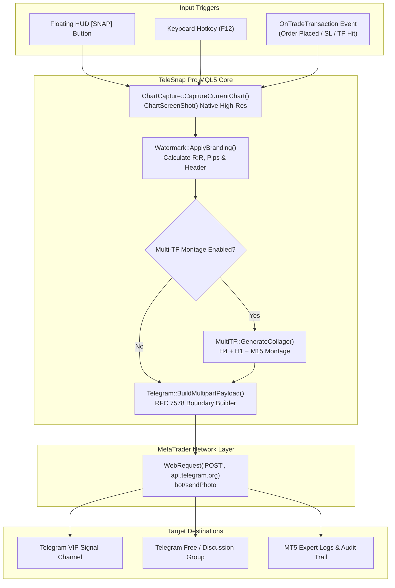

# ⚡ TeleSnap Pro: High-Speed MetaTrader to Telegram Signal Snapper

<div align="center">

[](#)
[](#)
[](https://core.telegram.org/bots/api)
[](#)
[](https://www.mql5.com)
[](#)

**Transform your chart analysis into watermarked, high-converting Telegram signals in under 300 milliseconds.**

[Features](#-key-features) • [Architecture](#-architecture) • [Quick Start](#-quick-start) • [Marketplace Strategy](#-monetization--market-strategy) • [Roadmap](#-roadmap)

</div>

---

## 🎯 The Urgent Problem TeleSnap Solves

Every single day, tens of thousands of Telegram signal providers, prop-firm traders, and trading mentors face the same friction:
1. **The 60-Second Delay:** When a high-probability setup triggers, the trader must open Snipping Tool / Lightshot, crop the chart, save the image, open Telegram, drag the image, type Symbol, Entry, Stop Loss, and Take Profit. By the time subscribers see the message, the price has slipped 5–15 pips.
2. **Signal Theft & Copycats:** Without fast, automated watermarking, rival channels steal and repost clean chart screenshots as their own.
3. **Amateur Branding:** Manually typed messages look unpolished and lack key analytics like Risk-to-Reward (R:R) ratio, pip distance, and timeframe context.

**TeleSnap Pro solves this permanently:** One click on a sleek floating chart button (or pressing `F12`) instantly renders the chart, stamps your VIP branding, calculates risk metrics, and dispatches a high-resolution photo with formatted Telegram markdown directly to your channel in **under 300ms**.

---

## 🌟 Key Features

### 1. ⚡ 1-Click Floating Chart HUD & Hotkey (`F12`)
- Draggable on-chart button with real-time status indicators (Ready / Sending / Sent).
- Global keyboard hotkey trigger (`F12`) for zero-mouse latency.
- Instant feedback via chart notifications or discreet sound cues.

### 2. 🛡️ 100% DLL-Free Native WebRequest Engine
- Built entirely on native MQL5 `WebRequest()` and RFC 7578 multipart/form-data encoding.
- **Passes MQL5 Marketplace automated validation** with zero DLL warnings or security alerts.
- Works smoothly on Windows VPS and local workstations alike.

### 3. 🏷️ Intelligent Watermark & Branding Overlay
- Automatic channel handle watermark (`@YourVIPChannel`) positioned dynamically to never obscure candlesticks.
- Trade metadata header stamped directly onto the image:
  - Symbol & Timeframe (e.g., `EURUSD • M15`)
  - Order Type & Entry Price
  - Stop Loss & Take Profit with pip distance
  - Calculated Risk-to-Reward ratio (e.g., `R:R = 1:3.2`)

### 4. 🤖 Automated Trade-Event Snapping (Hands-Free Mode)
- **OnTradeOpen:** Automatically snaps and posts when an order is executed.
- **OnSLHit / OnTPHit:** Dispatches immediate trade outcome verification screenshots ("Trade Closed: +45 Pips ✅").
- Builds undeniable proof-of-work credibility for your Telegram subscribers.

### 5. 🧩 Multi-Timeframe Montage Engine (Pro Edition)
- Optional 3-in-1 multi-timeframe collage generator:
  - Macro Bias (`H4`)
  - Market Structure (`H1`)
  - Precise Entry (`M15` or `M5`)
- Merges all three charts into a single ultra-clean montage image before sending.

---

## 🏗️ Architecture



---

## 📁 Repository Structure

```text
TeleSnap-Pro/
├── MQL5/
│   ├── Experts/
│   │   └── TeleSnap_Pro.mq5          # Primary Expert Advisor & User Entry Point
│   └── Include/
│       └── TeleSnap/
│           ├── Config.mqh             # Configuration parameters & Enums
│           ├── Telegram.mqh           # Native multipart/form-data WebRequest client
│           ├── ChartCapture.mqh       # High-res screen capture & dimension handlers
│           ├── Watermark.mqh          # On-chart branding & trade metrics overlay
│           ├── UI.mqh                 # Draggable floating HUD button & controls
│           └── TradeMonitor.mqh       # Event listener for auto-snapping on trade events
├── docs/
│   ├── BRAINSTORMING_AND_ROADMAP.md   # Deep monetization strategy, roadmap & specs
│   ├── MQL5_MARKET_LISTING.md         # High-converting product sales copy & screenshots guide
│   └── USER_MANUAL.md                 # Complete buyer setup guide (Bot token, WebRequest URL)
├── scripts/
│   └── deploy_to_mt5.bat              # Auto-detects MT5 terminal and symlinks/deploys files
├── .gitignore                         # Excludes compiled .ex5, caches and credentials
└── README.md                          # Repository overview and documentation
```

---

## 🚀 Quick Start

### 1. Telegram Bot Setup (2 Minutes)
1. Message [`@BotFather`](https://t.me/BotFather) on Telegram and send `/newbot`.
2. Copy your **Bot API Token** (e.g., `123456789:ABCdefGhIJKlmNoPQRsTUVwxyZ`).
3. Add your bot to your target Telegram Channel or Group as an **Administrator** with permission to post messages.
4. Obtain your channel ID or username (e.g. `@MyForexSignals` or `-1001234567890`).

### 2. MetaTrader 5 Configuration
In MetaTrader 5, allow WebRequests to the Telegram API:
1. Open **Tools** → **Options** (`Ctrl + O`) → **Expert Advisors** tab.
2. Check **Allow WebRequest for listed URL**.
3. Add: `https://api.telegram.org`
4. Click **OK**.

### 3. Deploy & Attach
1. Run `scripts\deploy_to_mt5.bat` or copy `MQL5/` contents directly to your MetaTrader 5 `MQL5` directory.
2. In MetaEditor, press `F7` on `TeleSnap_Pro.mq5` to compile.
3. Drag `TeleSnap_Pro` from the MT5 Navigator onto any active chart.
4. Input your **Bot Token** and **Chat ID** in the inputs dialogue.
5. Click the on-chart **[ 📸 SNAP & SEND ]** button or press **`F12`**!

---

## 💰 Monetization & Market Strategy

TeleSnap Pro is architected around a 3-tier monetization model designed for immediate cashflow:

| Tier | Distribution Channel | Pricing | Value Proposition |
| :--- | :--- | :--- | :--- |
| **Free Lite** | MQL5 Market Free Section | **Free** | Core manual snap with fixed watermark: `Powered by TeleSnap Pro`. Turns every signal provider into a viral billboard. |
| **TeleSnap Pro** | MQL5 Market Paid Section | **$49 – $79** One-Time | Full customization, custom watermarks, multi-timeframe collage, auto-trade snapping, unlimited channels. |
| **White-Label Agency** | Direct B2B / Telegram Mentors | **$250 – $500** Setup | Custom proprietary branding, exclusive indicator overlays, and dedicated signal formatting for large trading groups (5k–50k members). |

---

## 🗺️ Roadmap

- [x] Architecture design & native MQL5 multipart WebRequest specification
- [x] Project workspace initialization & documentation
- [ ] Core MQL5 Expert Advisor implementation (`TeleSnap_Pro.mq5`)
- [ ] Native Telegram multipart uploader (`Telegram.mqh`)
- [ ] On-chart floating HUD & draggable button UI (`UI.mqh`)
- [ ] Automated trade execution listener (`TradeMonitor.mqh`)
- [ ] Multi-timeframe collage engine (`ChartCapture.mqh`)
- [ ] MQL5 Marketplace compliance audit and compilation verification
- [ ] MT4 backward compatibility bridge (`MQL4/`)

---

## 📄 License

Proprietary Commercial Software. All rights reserved. Open-source core components provided under the [MIT License](LICENSE).
