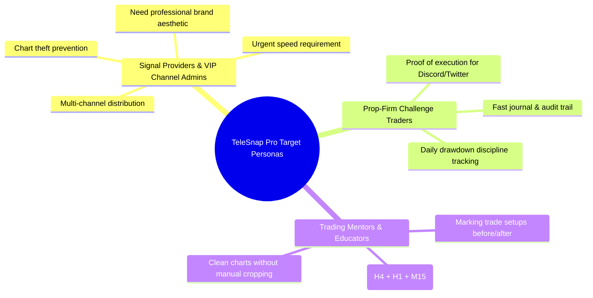
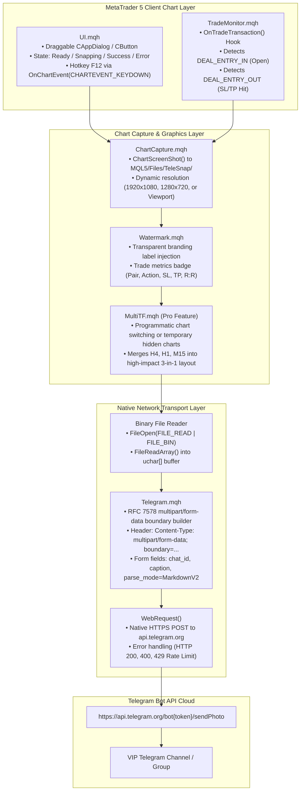

# 🧠 TeleSnap Pro: Strategic Brainstorming, Architecture & Monetization Blueprint

> **Executive Summary:**  
> TeleSnap Pro is an ultra-fast, professional MetaTrader 4 & 5 utility designed specifically for Telegram signal providers, retail trading communities, prop-firm traders, and trading educators. It solves the costly 30–60 second delay of manual chart capture, markup, watermarking, and typing by replacing it with a **1-click on-chart floating HUD button, global hotkey (`F12`), or automatic trade-event trigger** that delivers branded, watermarked, high-resolution chart snapshots and structured signal details to Telegram channels in **under 300 milliseconds**.

---

## 1. The Market Opportunity & Pain Point Analysis

### 1.1 Market Size & User Personas
MetaTrader (MT4 and MT5) remains the dominant retail trading execution platform worldwide, with millions of daily active users across Forex, Indices, Commodities, and Crypto CFDs. Alongside this ecosystem is a massive secondary economy: **Telegram Trading Signal Channels**.

There are currently over **50,000+ active Telegram trading channels and groups**, ranging from small private clubs (50–200 members) to massive signal syndicates (10,000–250,000 members), charging anywhere from **$30 to $150/month** per subscriber.

### 1.2 The Core Trader Pain Points

| Current Manual Workflow | Time Lost | Friction & Consequences |
| :--- | :--- | :--- |
| 1. Spot setup on MT4/MT5 chart | 0s | Fast-moving markets (Gold/XAUUSD, US30, NAS100) move 10–30 pips in seconds. |
| 2. Open Snipping Tool / Lightshot | 5–10s | User switches window, drags crop boundaries. |
| 3. Add manual text / arrows / watermark | 10–20s | Drawing in Paint/Photoshop or third-party tool is tedious and looks inconsistent. |
| 4. Save image or copy to clipboard | 3–5s | File system clutter or clipboard overwrite. |
| 5. Switch to Telegram, paste photo | 3–5s | App switching delay. |
| 6. Type Symbol, Type, SL, TP, R:R | 15–30s | Typos happen frequently, leading to subscriber complaints and bad entries. |
| **Total Friction** | **35–70s** | **Price slips 5–25 pips. Setup invalidated or stolen by copycat channels.** |

### 1.3 The TeleSnap Pro Solution
- **Single Click / Hotkey (`F12`):** Trader sees the setup, presses `F12` or clicks the on-chart HUD button.
- **Instant Processing (<300ms):**
  - High-resolution `ChartScreenShot()` captures clean candlestick action and indicators.
  - Transparent custom watermark (`@YourVIPHandle`) stamped automatically.
  - Active trade levels (Entry, Stop Loss, Take Profit, Pip Risk, Risk:Reward) calculated from open ticket or chart crosshair.
  - Multi-timeframe montage generated (optional H4 + H1 + M15).
  - RFC 7578 multipart/form-data payload constructed natively in MQL5 memory.
  - HTTPS `WebRequest()` POST dispatched to `https://api.telegram.org/bot<TOKEN>/sendPhoto`.
- **Subscriber Experience:** High-definition branded chart appears in the VIP Telegram channel with instant copyable trade levels within 1 second.

---

## 2. Technical Architecture & Engineering Specifications

### 2.1 Native MQL5 / MQL4 Architecture (Zero External DLLs)

A primary barrier to distribution on the official **MQL5 Marketplace** is the DLL restriction: MetaQuotes strictly forbids external DLLs in Marketplace products for security and cross-platform compatibility.

TeleSnap Pro is designed from the ground up to be **100% native MQL5**, using zero external libraries or DLLs:

### 2.2 Core Modules Breakdown

1. **`TeleSnap_Pro.mq5` (Main Entry Point):**
   - Handles EA lifecycle (`OnInit`, `OnDeinit`, `OnTick`, `OnChartEvent`, `OnTradeTransaction`).
   - Declares user inputs with property groups (`Telegram Bot Settings`, `Watermark & Branding`, `Capture Triggers`, `UI Preferences`).

2. **`Telegram.mqh` (The Networking Engine):**
   - Implements native RFC 7578 multipart/form-data encoding in MQL5 byte arrays (`uchar[]`).
   - Sends photos with rich MarkdownV2 formatted captions, buttons, and hashtags (`#EURUSD #BUY #Signal`).
   - Implements exponential backoff retry on HTTP 429 rate limit errors.

3. **`ChartCapture.mqh` (The Imaging Engine):**
   - Executes `ChartScreenShot(0, filename, width, height, ALIGN_RIGHT)`.
   - Supports viewport snapping or fixed aspect ratio (16:9 / 4:3) optimized for mobile Telegram displays.
   - Cleans up temporary disk assets immediately after dispatch to preserve disk space.

4. **`Watermark.mqh` (Branding & Risk Calculations):**
   - Calculates pips distance based on `_Digits` (handling 3/5 digit brokers and JPY pairs).
   - Calculates Risk-to-Reward ratio (`abs(TP - Entry) / abs(Entry - SL)`).
   - Generates aesthetic text badges directly on the chart before snapping, and cleans them up cleanly without disrupting the user's manual drawings.

5. **`UI.mqh` (The HUD Control Panel):**
   - Floating on-chart HUD button with modern neon/dark theme.
   - Remembers position across chart changes and terminal restarts.
   - Provides visual status animation: Blue (Ready) → Yellow (Snapping) → Green (Dispatched) → Red (Network Error).

6. **`TradeMonitor.mqh` (Automated Proof-of-Trade Engine):**
   - Listens to `OnTradeTransaction`.
   - When a trade opens, immediately captures chart with entry line and dispatches signal.
   - When a trade closes by hitting SL or TP, captures the exact exit candle and dispatches result card ("Take Profit 2 Hit: +65 Pips 🎯").

---

## 3. Monetization Engine & Go-To-Market Strategy

### 3.1 The 3-Tier Monetization Model

```mermaid
graph LR
    subgraph Tier1["Tier 1: Free Viral Lite"]
        F1["Free on MQL5 Market"]
        F2["Fixed Watermark:<br/>'Powered by TeleSnap Pro'"]
        F3["Acts as viral billboard<br/>in 1,000s of VIP channels"]
    end

    subgraph Tier2["Tier 2: Paid TeleSnap Pro"]
        P1["$49 - $79 One-Time on MQL5"]
        P2["Custom Watermark & Branding"]
        P3["Multi-TF Montage Engine"]
        P4["Auto-Trade Snapping on SL/TP"]
    end

    subgraph Tier3["Tier 3: White-Label Agency"]
        W1["$250 - $500 B2B Setup"]
        W2["Custom EA with VIP colors & logo"]
        W3["Integrated Telegram Copy-Trading"]
    end

    Tier1 -->|Converts 5-10% of users| Tier2
    Tier2 -->|High-value channel admins ask for custom features| Tier3
```

### 3.2 Revenue Projection (Months 1–6)

| Milestone | Active Free Users | Paid Pro Sales ($59) | B2B Custom Setups ($350) | Estimated Monthly Income |
| :--- | :--- | :--- | :--- | :--- |
| **Month 1** (Launch & Forum Seeding) | 250 | 15 ($885) | 1 ($350) | **$1,235** |
| **Month 2** (Viral Watermark compounding) | 800 | 45 ($2,655) | 3 ($1,050) | **$3,705** |
| **Month 3** (Top Rated in MQL5 Utilities) | 2,000 | 80 ($4,720) | 5 ($1,750) | **$6,470** |
| **Month 6** (Mature Established Tool) | 5,000+ | 120 ($7,080) | 8 ($2,800) | **$9,880** |

### 3.3 Why the Viral Watermark Model Is Unstoppable
Unlike standard trading indicators that stay hidden on a trader's computer, TeleSnap Pro images are **publicly broadcast to thousands of retail traders every hour**.
- Every free channel admin who posts 5 signals a day sends your watermark to 500–5,000 members.
- If 100 free users use TeleSnap Lite, your product link is shown to **~100,000 active retail traders every week for zero ad spend**.

---

## 4. Competitive Landscape & Edge

| Feature | Standard Manual Snipping | Generic MT5 Telegram Bots | **TeleSnap Pro** |
| :--- | :--- | :--- | :--- |
| **Time to Dispatch** | 45–90 seconds | 2–5 seconds (text only) | **< 300 milliseconds** (Chart + Signal) |
| **Chart Image Upload** | Manual crop & paste | Usually unsupported or requires Python | **Native high-res PNG dispatch** |
| **DLL Dependency** | None | High (Requires external DLLs) | **Zero DLLs (100% Native MQL5)** |
| **MQL5 Market Compliant**| N/A | Fails automated validation | **Full 1-Click Validation Ready** |
| **Dynamic Watermarking** | Manual graphic editor | None | **Automated customizable branding** |
| **Risk-to-Reward Math** | Manual calculation | Rough or missing | **Precision auto-calculated pips & R:R** |
| **Multi-Timeframe Montage**| Impossible without Photoshop| None | **Native 3-in-1 collage generation** |

---

## 5. Development Sprints & Action Plan

### Sprint 1: Foundation & Network Core (Day 1)
- [x] Create GitHub repository: `dchumari/TeleSnap-Pro`
- [x] Configure architecture blueprint & roadmap documentation
- [ ] Implement `Telegram.mqh`: Multipart/form-data encoding and HTTPS `WebRequest`
- [ ] Implement `ChartCapture.mqh`: Native `ChartScreenShot()` pipeline with error handling

### Sprint 2: UI & Watermark Engine (Day 2)
- [ ] Implement `UI.mqh`: Floating HUD button with drag support and hotkey `F12`
- [ ] Implement `Watermark.mqh`: Trade statistics overlay and custom branding text
- [ ] Integrate into `TeleSnap_Pro.mq5` entry point

### Sprint 3: Trade Monitor & Auto-Snapping (Day 3)
- [ ] Implement `TradeMonitor.mqh`: Hook `OnTradeTransaction` for automated execution snaps
- [ ] Add customizable templates (New Order, Take Profit Hit, Stop Loss Hit)

### Sprint 4: MQL5 Marketplace Validation & Packaging (Day 4)
- [ ] Pass MetaQuotes automated test suite (Zero memory leaks, zero infinite loops, zero DLLs)
- [ ] Prepare `MQL5_MARKET_LISTING.md` with promotional graphics specifications and sales copy
- [ ] Build 1-click Windows installer/symlink script `deploy_to_mt5.bat`
