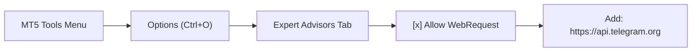

# 📖 TeleSnap Pro: Complete User Manual & Setup Guide

Welcome to **TeleSnap Pro**. This guide walks you through setting up your Telegram Bot, whitelisting the Telegram API in MetaTrader 5, and configuring on-chart features.

---

## 🛠️ Step 1: Create Your Telegram Bot (Takes 2 Minutes)

TeleSnap Pro communicates directly with Telegram's Bot API to post high-resolution photos and trade stats into your channel or group.

1. Open Telegram and search for [`@BotFather`](https://t.me/BotFather).
2. Start the chat and send `/newbot`.
3. Follow the prompts:
   - Choose a friendly display name (e.g., `Alpha Signals Dispatcher`).
   - Choose a username ending in `bot` (e.g., `alpha_signals_snap_bot`).
4. **Copy the Bot API Token**:
   BotFather will provide a token formatted like:
   `7192837465:AAFl9x_1234567890abcdefghijklmnopqrst`
   > ⚠️ **Security Tip:** Never share this token publicly. Keep it private.

---

## 📢 Step 2: Add Bot to Your Telegram Channel / Group

1. Open your target Telegram Channel or VIP Group.
2. Go to **Channel Info** → **Administrators** → **Add Administrator**.
3. Search for your bot username (e.g., `@alpha_signals_snap_bot`) and select it.
4. Ensure the bot has **Post Messages** and **Edit Messages** permissions.
5. Click **Save**.

---

## 🆔 Step 3: Find Your Channel Chat ID

- **Public Channels:**
  You can directly use the channel's public handle (e.g., `@MyVIPForexChannel`).
- **Private Channels / Supergroups:**
  1. Forward any message from your channel to [`@userinfobot`](https://t.me/userinfobot) or [`@JsonDumpBot`](https://t.me/JsonDumpBot).
  2. The bot will reply with the channel's numeric ID (usually starting with `-100`, for example: `-1001928374650`).
  3. Copy this entire ID (including the minus sign and `100`).

---

## 🌐 Step 4: Configure MetaTrader 5 WebRequest Whitelist

By default, MetaTrader blocks outgoing internet connections from Expert Advisors. You must grant permission for `https://api.telegram.org`:

1. In MetaTrader 5, click **Tools** → **Options** (or press `Ctrl + O`).
2. Select the **Expert Advisors** tab.
3. Check the box: **Allow WebRequest for listed URL**.
4. Double-click the empty line (green plus icon) and enter:
   ```text
   https://api.telegram.org
   ```
5. Click **OK** to save.



---

## 💻 Step 5: Install & Attach TeleSnap Pro

### Option A: 1-Click Deployment (Recommended)
Run the automated script included in this repository:
```cmd
scripts\deploy_to_mt5.bat
```
The script will locate your MetaTrader 5 Data Directory and copy all files to the correct folders.

### Option B: Manual Installation
1. In MetaTrader 5, click **File** → **Open Data Folder**.
2. Navigate to `MQL5\`.
3. Copy:
   - `TeleSnap_Pro.mq5` into `MQL5\Experts\`
   - The entire `TeleSnap\` folder into `MQL5\Include\`
4. Open **MetaEditor** (`F4`), locate `TeleSnap_Pro.mq5` in the Navigator, and press **`F7`** to compile.

### Attach to Chart:
1. In MetaTrader 5, open the **Navigator** window (`Ctrl + N`).
2. Expand **Expert Advisors** → find **TeleSnap_Pro**.
3. Drag it onto any active chart.
4. In the **Inputs** tab, fill in:
   - `InpBotToken`: Your BotFather API token.
   - `InpChatId`: Your Channel ID (e.g. `@MyVIPSignals` or `-1001928374650`).
   - `InpChannelTag`: Your branding handle to watermark on charts.
5. In the **Common** tab, ensure **Allow Algo Trading** is checked.
6. Click **OK**.

---

## 🎮 Step 6: Using TeleSnap Pro

- **1-Click On-Chart Button:** Click the **`[ 📸 SNAP & SEND ]`** button in the upper left corner of your chart.
- **Global Hotkey:** Press **`F12`** on your keyboard at any moment.
- **Hands-Free Auto-Snap:** If `InpTriggerMode` is set to `TRIGGER_AUTO_ALL_EVENTS`, TeleSnap will automatically photograph and post whenever you place a trade, hit Stop Loss, or hit Take Profit!

---

## ❓ Frequently Asked Questions (FAQ)

#### Q: The button turns red and says `❌ SEND FAILED`?
**A:** Check the **Experts** tab at the bottom of your MetaTrader window (`Ctrl + T` → Experts). 
- If you see `WebRequest failed: error 4014`, you forgot to whitelist `https://api.telegram.org` in **Tools → Options → Expert Advisors**.
- If you see HTTP error `400 Bad Request: chat not found`, make sure you added your bot as an **Administrator** to the channel.

#### Q: Does TeleSnap Pro work on MetaTrader 4?
**A:** Yes, the core architecture is cross-compatible. An MT4 version is available in the roadmap.
